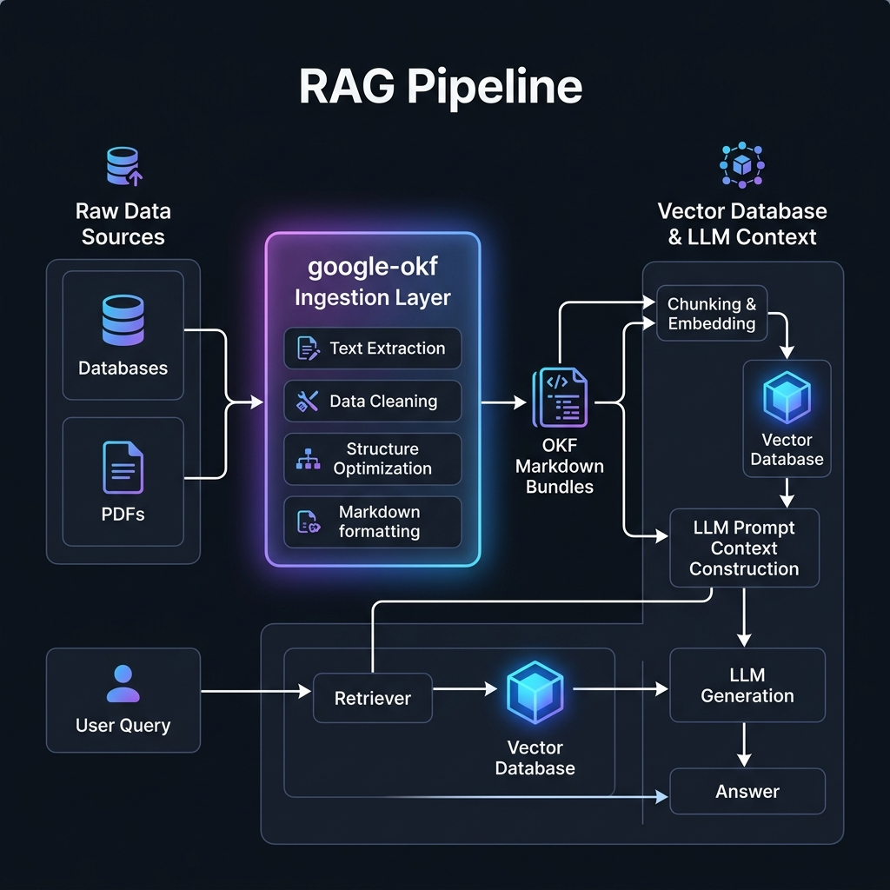

# google-okf

`google-okf` is an open-source Python library designed to automatically connect to various enterprise data sources and convert them into the standard **Google Open Knowledge Format (OKF)**. 

By standardizing database schemas, collections, documentation, playbooks, and APIs into clean Markdown files with structured YAML frontmatter, `google-okf` acts as the critical intermediate context-assembly layer for Retrieval-Augmented Generation (RAG) pipelines and agentic AI systems.

* **PyPI Link**: [google-okf on PyPI](https://pypi.org/project/google-okf/)
* **Repository**: [GitHub Repository](https://github.com/SachinMishra-ux/Open_Knowledge_Format)

---

## 🧩 RAG Pipeline Integration Flow

`google-okf` acts as the ingestion and semantic translation layer in your intelligence stack:



---

## Getting Started

### Installation

!!! note "Installation Steps"
    You can easily install the library using `pip` from PyPI:
    ```bash
    pip install google-okf
    ```

    Or using `uv` inside your virtual environment:
    ```bash
    uv add google-okf
    ```

---

## Quickstart (CLI)

`google-okf` includes a robust CLI tool to manage and build OKF bundles:

### 1. Initialize a Bundle
Create a blank OKF folder structure with default subdirectories:
```bash
google-okf init my_knowledge_bundle
```

### 2. Run a Flat Files Producer
Import a directory of PDF/DOCX/Markdown/TXT files into your bundle:
```bash
google-okf produce --type files --src-dir ./raw_documents --out-dir my_knowledge_bundle
```

### 3. Validate Link Compliance
Verify that all YAML frontmatter compiles and all internal relative markdown links resolve correctly:
```bash
google-okf lint my_knowledge_bundle
```
